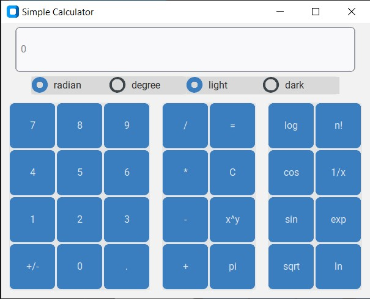
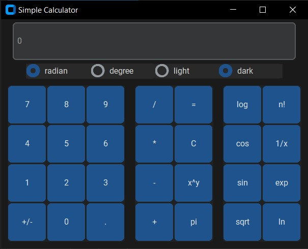

# Introduction #
This is a simple calculator, which is devloped in Python.
This version is super simple, with least possible features. But it will be modified and more features will be included.
The currently uploaded simple calculator include only the main mathematical operators (+,-,*,/), and some advanced functions,
such as sin, cos, log, ln, exp, n!, etc. The angle degree could also be choosen between degree and radian.
It does support keyboard actions. These are its keyboard responses:

            numerical keys act as pressing a number button
            
            operational keys act as pressing an operation button
            
            ESC, c, and C act as pressing C button (clear)
            
            Enter, e, and E act as pressing = button
            
            x, X act as closing the window
            
            s, S for sqrt
            
            r, R: change angle unit to radian
            
            d, D: change angle unit to degree
            
            x, X: close the program
            
            
The application is improving, and will include more features soon.
The GUI is implemented using **customtkinter**.
Please feel free to inform me for any bug or mistake, or wrong operation.
Please also let me have if any suggestion for improvment.
mbalali.freelancer@gmail.com

